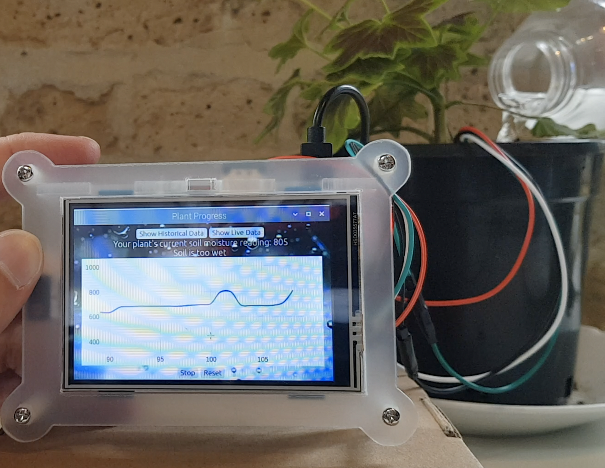

[](https://travis-ci.com/breycarr/deep_root) [](https://codeclimate.com/github/breycarr/deep_root/maintainability) [](https://bettercodehub.com/)

# Project DEEPROOT by Team C A C T U S
We were the 🛠  hardware team ⚒ for the final group project at Makers Academy.  

We built a portable soil moisture tracker to help monitor plant health by letting users know if it was time to water their plant or if it was best to leave it for a while due to overwatering. The touchscreen shows a real-time graph showing the soil moisture readings. The user can also switch to a historical graph, which displays all the readings taken.



## Technologies

H A R D W A R E

* Raspberry Pi 4
* Adafruit Soil Moisture Sensor
* 4 Pin JST Cable
* LCD touchscreen
* Jumper wires
* Battery pack

S O F T W A R E
* Backend: Python3
* Frontend: JavaScript, HTML, CSS
* Framework bridging front-end and back-end: Eel

D E V E L O P M E N T
* Test framework: Pytest for Python3
* Code Quality: Pylama and ESLint

## Hardware Construction

The 4 Pin JST Cable connects the Soil Moisture Sensor to pins 1 (power), 3 and 5 (I2C), and 9 (ground):


The LCD touchscreen covers all of these pins, so manual adjustment of the wires is necessary. A full explanation of how to connect the multiple slave devices can be found in [this blog post](https://medium.com/@makers_c_a_c_t_u_s/multiple-slave-devices-not-enough-rpi-gpio-pins-no-problem-c3403a981623)

## Installation on Your Raspberry Pi

In the terminal, run:

```
> python --version                                      # Check you have Python installed

> brew install python3                                  # Run if you don't have Python installed
> git clone git@github.com:breycarr/deep_root.git
> cd deep_root
> pip3 install -r requirements.txt                      # Install the necessary dependencies for Python
> npm install                                           # Install dependencies for JavaScript
> cd src
> python3 -m eel app.py web --noconsole --onefile       # Creates executable for desktop icon
```

## Using the App


- On your touchscreen, double tap on the cactus icon.
- Select `Start` to monitor the soil's moisture.
- Select `Refresh` if you want to monitor a different plant and start graph again.
- Select `View Historical Data` to see the graph with all the past soil readings.

### Video

[](http://www.youtube.com/watch?v=JEetrixBYKU "Project Deep Root")

## Testing

To run tests for this project, after you have downloaded the repo, run the following in your terminal:

```
> pytest --cov   # To run tests and see test coverage for Python3     
```

## PROJECT PROCESS


### Documentation

We have a Team C A C T U S [blog](https://medium.com/@makers_c_a_c_t_u_s) on Medium, documenting significant moments, such as setting up the hardware for the first time or a fixing a particularly stubborn error.

We used [Trello](https://trello.com/b/DZAhiebz/c-a-c-t-u-s) to divide our daily tasks and assign tickets to pairs. Checkout this repo's [wiki](https://github.com/breycarr/deep_root/wiki) for our group's daily diary using agile methodologies. You can also find the project's:
- [MVP](https://github.com/breycarr/deep_root/wiki/MVP)
- [Cacti Garden](https://github.com/breycarr/deep_root/wiki/Cacti-Garden)


### Release History

* 1.0
    * MVP Achieved: LED light display to track plant health.
* 2.0
    * MVP Acheived: A touchscreen to track plant, generating a real-time graph.


### Authors' Details

* [Ben Reynolds-Carr](https://github.com/breycarr)
* [Francesca Chater](https://github.com/fetc90)
* [Laurence Taylor](https://github.com/LaurenceTaylor)
* [Oliver Brownlow](https://github.com/olliebrownlow)
